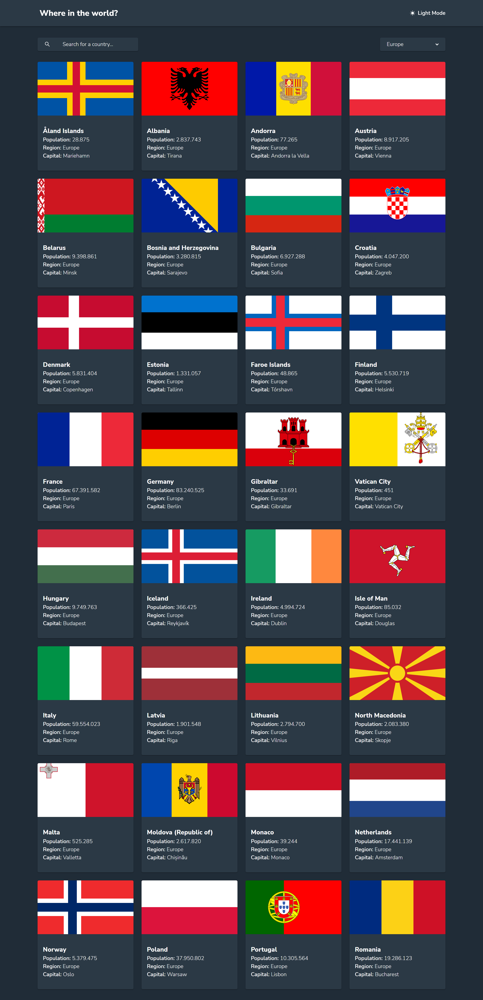

# Frontend Mentor - REST Countries API with color theme switcher solution

This is a solution to the [REST Countries API with color theme switcher challenge on Frontend Mentor](https://www.frontendmentor.io/challenges/rest-countries-api-with-color-theme-switcher-5cacc469fec04111f7b848ca). Frontend Mentor challenges help you improve your coding skills by building realistic projects. 

## Overview

### The challenge

Users should be able to:

- See all countries from the API on the homepage
- Search for a country using an `input` field
- Filter countries by region
- Click on a country to see more detailed information on a separate page
- Click through to the border countries on the detail page
- Toggle the color scheme between light and dark mode *(optional)*

### Screenshot

### Links

- Live Site URL: [https://emiacerbi-countries.vercel.app/](Link)

## My process

### Built with

- Semantic HTML5 markup
- CSS custom properties
- CSS Grid
- Mobile-first workflow
- [React](https://reactjs.org/) - JS library
- [Vite.js](https://vitejs.dev/) - React framework
- [Sass](https://sass-lang.com/) - For styles
- [Redux](https://redux.js.org/) - To manage state

### What I learned

In this particular project I wanted to practice with Redux, that's why I used it for managing the state of the app. In this case, I used it to switch the themes. The first time that you visit the page, it's by default on light mode. But once you choose your theme, the browser will remember it with local storage. 

### Useful resources

- [React Spinners](https://adexin.github.io/spinners/) - This is what I used for the spinners. 

## Author

- Website - [Personal Portfolio](https://personal-portfolio-six-flax.vercel.app/)
- Linked In - [Emi](https://www.linkedin.com/in/emiliano-acerbi-7a7141235/)